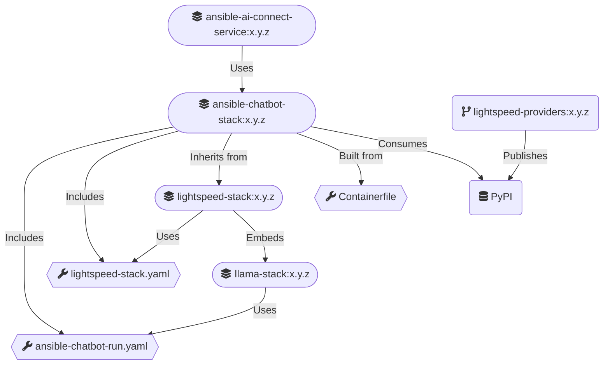

# Ansible Chatbot (llama) Stack

This repository contains the necessary configuration to build a Docker Container Image for `ansible-chatbot-stack`.

`ansible-chatbot-stack` builds on top of `lightspeed-stack` that wraps Meta's `llama-stack` AI framework.

`ansible-chatbot-stack` includes various customisations for:

- A remote vLLM inference provider (RHOSAI vLLM compatible)
- The inline sentence transformers (Meta)
- AAP RAG database files and configuration
- [Lightspeed external providers](https://github.com/lightspeed-core/lightspeed-providers)
- System Prompt injection

Build/Run overview:



## Build

### Setup for Ansible Chatbot Stack

- External Providers YAML manifests must be present in `providers.d/` of your host's `llama-stack` directory.
- Vector Database is copied from the latest `aap-rag-content` image to `./vector_db`.
- Embeddings image files are copied from the latest `aap-rag-content` image to `./embeddings_model`.

```shell
        make setup
```

### Building Ansible Chatbot Stack

Builds the image `ansible-chatbot-stack:$ANSIBLE_CHATBOT_VERSION`.

> Change the `ANSIBLE_CHATBOT_VERSION` version and inference parameters below accordingly.

```shell
    export ANSIBLE_CHATBOT_VERSION=0.0.1
    
    make build
```

### Container file structure

#### Files from `lightspeed-stack` base image
```commandline
└── app-root/
    ├── .venv/
    └── src/
        ├── <lightspeed-stack files>
        └── lightspeed_stack.py
````

#### Runtime files

> These are stored in a `PersistentVolumeClaim` for resilience
```commandline
└── .llama/
    └── data/
        └── distributions/
            └── ansible-chatbot/
                ├── aap_faiss_store.db
                ├── agents_store.db
                ├── responses_store.db
                ├── localfs_datasetio.db
                ├── trace_store.db
                └── embeddings_model/
```

#### Configuration files
```commandline
└── .llama/
    ├── distributions/
    │   └── llama-stack/
    │       └── config
    │           └── ansible-chatbot-run.yaml
    │   └── ansible-chatbot/
    │       ├── ansible-chatbot-version-info.json    
    │       └── config
    │           └── lightspeed-stack.yaml
    │       └── system-prompts/
    │           └── default.txt
    └── providers.d
        └── <llama-stack external providers>
```

## Run

Runs the image `ansible-chatbot-stack:$ANSIBLE_CHATBOT_VERSION` as a local container.

> Change the `ANSIBLE_CHATBOT_VERSION` version and inference parameters below accordingly.

### System Prompt

Select the system prompt file based on the model type:

| Model type | System prompt file |
|---|---|
| Granite models | `ansible-chatbot-system-prompt-granite-compat.txt` |
| OpenAI-compatible models (default) | `ansible-chatbot-system-prompt.txt` |

```shell
    export ANSIBLE_CHATBOT_VERSION=0.0.1
    export ANSIBLE_CHATBOT_VLLM_URL=<YOUR_MODEL_SERVING_URL>
    export ANSIBLE_CHATBOT_VLLM_API_TOKEN=<YOUR_MODEL_SERVING_API_TOKEN>
    export ANSIBLE_CHATBOT_INFERENCE_MODEL=<YOUR_INFERENCE_MODEL>
    export ANSIBLE_CHATBOT_INFERENCE_MODEL_FILTER=<YOUR_INFERENCE_MODEL_TOOLS_FILTERING>
    
    make run
```

## Basic tests

Runs basic tests against the local container.

> Change the `ANSIBLE_CHATBOT_VERSION` version and inference parameters below accordingly.

```shell
    export ANSIBLE_CHATBOT_VERSION=0.0.1
    export ANSIBLE_CHATBOT_VLLM_URL=<YOUR_MODEL_SERVING_URL>
    export ANSIBLE_CHATBOT_VLLM_API_TOKEN=<YOUR_MODEL_SERVING_API_TOKEN>
    export ANSIBLE_CHATBOT_INFERENCE_MODEL=<YOUR_INFERENCE_MODEL>
    export ANSIBLE_CHATBOT_INFERENCE_MODEL_FILTER=<YOUR_INFERENCE_MODEL_TOOLS_FILTERING>
    
    make run-test
```

## Sanity tests

End-to-end sanity tests exercise the full chatbot stack against real LLM backends.
Unlike the basic tests, these make actual inference calls — no mock server.
Tests for a given provider are skipped automatically when the required environment variables are not set.

### Supported providers

| Provider | Make target | Required environment variables |
|----------|-------------|-------------------------------|
| Granite (vLLM) | `make test-sanity-granite` | `VLLM_URL`, `VLLM_API_TOKEN`, `INFERENCE_MODEL` |
| OpenAI | `make test-sanity-openai` | `OPENAI_API_KEY`, `OPENAI_INFERENCE_MODEL` |
| Azure OpenAI | `make test-sanity-azure` | `AZURE_OPENAI_BASE_URL`, `AZURE_OPENAI_API_KEY`, `AZURE_OPENAI_INFERENCE_MODEL` |
| Vertex AI | `make test-sanity-vertexai` | `VERTEX_AI_CREDENTIALS`, `VERTEX_AI_PROJECT` |

### Prerequisites

```shell
    make setup-sanity-test-data   # downloads embeddings model and creates vector DB under .test_data/
    make build                    # builds the container image (ANSIBLE_CHATBOT_VERSION required)
```

### Running sanity tests

Run all providers in sequence (providers without credentials are skipped):

```shell
    make test-sanity
```

Run a single provider:

```shell
    # Granite (vLLM)
    export VLLM_URL=<YOUR_VLLM_URL>
    export VLLM_API_TOKEN=<YOUR_VLLM_API_TOKEN>
    export INFERENCE_MODEL=<YOUR_MODEL_NAME>
    make test-sanity-granite

    # OpenAI
    export OPENAI_API_KEY=<YOUR_OPENAI_API_KEY>
    export OPENAI_INFERENCE_MODEL=<YOUR_MODEL_NAME>   # e.g. gpt-4o-mini
    make test-sanity-openai

    # Azure OpenAI
    export AZURE_OPENAI_BASE_URL=<YOUR_AZURE_ENDPOINT>   # e.g. https://<resource>.openai.azure.com
    export AZURE_OPENAI_API_KEY=<YOUR_AZURE_API_KEY>
    export AZURE_OPENAI_INFERENCE_MODEL=<YOUR_DEPLOYMENT_NAME>
    make test-sanity-azure

    # Vertex AI
    export VERTEX_AI_CREDENTIALS='<SERVICE_ACCOUNT_JSON>'
    export VERTEX_AI_PROJECT=<YOUR_GCP_PROJECT>
    # optional: VERTEX_AI_LOCATION (default: us-central1)
    # optional: VERTEX_AI_INFERENCE_MODEL (default: google/gemini-2.5-pro)
    make test-sanity-vertexai
```

**Note:** In Llama Stack versions 0.4 through 0.5, the Vertex AI provider hardcodes support to the following three
models:
- `google/gemini-2.0-flash`
- `google/gemini-2.5-flash`
- `google/gemini-2.5-pro`

### MCP sanity tests

These start real Automation Controller and Lightspeed MCP servers against a
**mock AAP** (no live AAP instance). Tool calls are expected to return HTTP 404;
the suite checks that `lightspeed_inline_agent` tool filtering runs and that a
failing tool call does not take the chatbot down.

`make test-sanity` includes this suite. MCP tests use the same LLM provider
variables as above and skip a provider when its credentials are unset. They also
skip (rather than fail) if the MCP images cannot be pulled.

**Granite (vLLM) requires tool-calling enabled on the server, and the granite-compat
system prompt.** Two things must both be true for granite to actually invoke a tool:

1. `vllm serve` must be started with `--enable-auto-tool-choice` and a matching
   `--tool-call-parser`, otherwise the model's tool-call output is never parsed into
   an executable call, regardless of what the system prompt says. See
   [vLLM's tool calling docs](https://docs.vllm.ai/en/latest/features/tool_calling.html)
   for the parser name matching your Granite model/vLLM version.
2. The chatbot must be running with `ansible-chatbot-system-prompt-granite-compat.txt`
   (see [System Prompt](#system-prompt) above) — it instructs the model to emit the
   literal `<|tool_call|>[...]` format the vLLM parser looks for. The sanity fixtures
   select this automatically for the `granite` provider.

If either is missing, the chatbot still logs the tool as filtered-in and available,
but no request ever reaches the MCP server or mock AAP, and
`test_tool_call_error_is_handled` fails.

```shell
    # All providers that have credentials set
    make test-sanity-mcp

    # Print how many tools were in the catalog vs how many the filter kept
    MCP_DEBUG=1 make test-sanity-mcp

    # One provider
    pytest tests/sanity/ -v -m "mcp and granite"
```

Default images ([ansible-mcp-tools](https://github.com/ansible/ansible-mcp-tools)):

| Variable | Default |
|----------|---------|
| `MCP_CONTROLLER_IMAGE` | `quay.io/ansible/ansible-mcp-controller:latest` (port 8004) |
| `MCP_LIGHTSPEED_IMAGE` | `quay.io/ansible/ansible-mcp-lightspeed:latest` (port 8005) |

Set `MCP_IMAGE` to use one image for both containers. Override the mock AAP port
with `MCP_AAP_MOCK_PORT` (default 18080).

Ports that must be free: **8322** (chatbot), **8004** / **8005** (MCP SSE), and
the mock AAP port. Stop any chatbot already serving on 8322 before running MCP
tests so the sidecars are not attached to the wrong stack.

**Linux only in practice:** the mock AAP binds `127.0.0.1` on the host while
the MCP containers run with `--network host`. On Linux both share the same
network namespace, so the containers can reach the mock. Under podman-machine
on macOS, `--network host` is the *VM's* host network, so the MCP containers
cannot reach a mock bound on the Mac host, and this suite times out.

### CI

The sanity tests run as a separate GitHub Actions workflow (`.github/workflows/test-sanity.yml`).
The workflow is triggered manually via `workflow_dispatch` from the Actions UI.
Provider credentials are stored as repository secrets with a `SANITY_` prefix:

| Secret | Provider |
|--------|----------|
| `SANITY_VLLM_URL`, `SANITY_VLLM_API_TOKEN`, `SANITY_INFERENCE_MODEL` | Granite (vLLM) |
| `SANITY_OPENAI_API_KEY`, `SANITY_OPENAI_INFERENCE_MODEL` | OpenAI |
| `SANITY_AZURE_OPENAI_BASE_URL`, `SANITY_AZURE_OPENAI_API_KEY`, `SANITY_AZURE_OPENAI_INFERENCE_MODEL` | Azure OpenAI |
| `SANITY_VERTEX_AI_CREDENTIALS`, `SANITY_VERTEX_AI_PROJECT` | Vertex AI |

Providers whose secrets are absent are skipped rather than failed.
The workflow also pulls the MCP server images; MCP tests skip if a pull fails.

## AAP quality evaluations

AAP Chatbot Quality evaluations available:

* [AAP documentation retrieval evaluation](https://github.com/ansible/ansible-wisdom-testing/blob/main/README.md#chatbot-evaluation-testing)
* [AAP Inventory file generation evaluation](https://github.com/ansible-automation-platform/aap-installers-rag-content/tree/main/tools#usage)

## Deploy into a k8s cluster

### Change configuration in `kustomization.yaml` accordingly, then

```shell
    kubectl kustomize . > my-chatbot-stack-deploy.yaml
```

### Deploy the service

```shell
    kubectl apply -f my-chatbot-stack-deploy.yaml
```

## Appendix - Generating system prompt files

The system prompt files (`ansible-chatbot-system-prompt.txt` and `ansible-chatbot-system-prompt-granite-compat.txt`)
are generated from the upstream [operator template](https://github.com/ansible/ansible-ai-connect-operator/blob/main/roles/chatbot/templates/chatbot.configmap_system_prompt.yaml.j2).

To regenerate them after the upstream template changes:

```shell
    python3 scripts/generate_system_prompts.py
```

## Appendix - Host clean-up

If you have the need for re-building images, apply the following clean-ups right before:

```shell
    make clean
```

## Appendix - Obtain a container shell

```shell
    # Obtain a container shell for the Ansible Chatbot Stack.
    make shell
```

## Appendix - Run from source (PyCharm)
1. Clone the [lightspeed-core/lightspeed-stack](https://github.com/lightspeed-core/lightspeed-stack) repository to your development environment.
2. In the ansible-chatbot-stack project root, create `.env` file in the project root and define following variables:
    ```commandline
    PYTHONDONTWRITEBYTECODE=1
    PYTHONUNBUFFERED=1
    PYTHONCOERCECLOCALE=0
    PYTHONUTF8=1
    PYTHONIOENCODING=UTF-8
    LANG=en_US.UTF-8
    VLLM_URL=(VLLM URL Here)
    VLLM_API_TOKEN=(VLLM API Token Here)
    INFERENCE_MODEL=granite-3.3-8b-instruct

    LIBRARY_CLIENT_CONFIG_PATH=./ansible-chatbot-run.yaml
    # For OpenAI-compatible models (default):
    SYSTEM_PROMPT_PATH=./ansible-chatbot-system-prompt.txt
    # For Granite models:
    # SYSTEM_PROMPT_PATH=./ansible-chatbot-system-prompt-granite-compat.txt
    EMBEDDINGS_MODEL=./embeddings_model
    VECTOR_DB_DIR=./vector_db
    PROVIDERS_DB_DIR=./work
    EXTERNAL_PROVIDERS_DIR=./llama-stack/providers.d
    ```
3. Create a Python run configuration with following values:
    - script/module: `script`
    - script path: `(lightspeed-stack project root)/src/lightspeed_stack.py`
    - arguments: `--config ./lightspeed-stack_local.yaml`
    - working directory: `(ansible-chatbot-stack project root)`
    - path to ".env" files: `(ansible-chatbot-stack project root)/.env`
4. Run the created configuration from PyCharm main menu.

#### Note: 
If you want to debug codes in the `lightspeed-providers` project, you 
can add it as a local package dependency with:
```commandline
uv add --editable (lightspeed-providers project root)
```
It will update `pyproject.toml` and `uv.lock` files.  Remember that 
they are for debugging purpose only and avoid checking in those local 
changes.